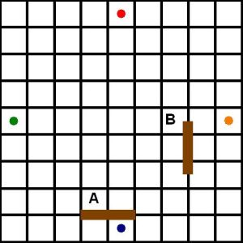

# Quoridor
# http://lewhub.github.io/WDI-Project-1/
My Project is a 2 or 4 player abstract strategy board game.
The objective  of the game is to be the first player to move their pawn to any space on the opposite side of the game board from which it begins.

## Rules:
1. Players can only move their pawn one square at a time.
2. Player have two choices when it's their turn: either move their pawn or place a barrier on the board to make it difficult for their opponent/opponents to reach their destination.
3. For a two person game, each player has access to 10 barriers (walls). In a four player game, each player has access to 5 walls each.
4. When placing a barrier, a player must always leave a way to reach the end of the board for their opponents. Thus, one cannot box in another player on their first three moves.
5. Walls can be placed directly between two spaces in any grove, **not** already occupied by a wall. Walls can be placed either vertically or horizontally, however a wall may not be placed where it cuts off the only remaining path of any pawn to the side of the board it must reach to win the game.
6. Pawns can be moved to an adjacent space (not diagonally), or, if adjacent to another pawn, a player may jump over that pawn. A player may move diagonally if jumping over another pawn will result in running into a wall. Players may not jump over walls.
7. Walls can be dragged and dropped from the side of the board to be placed into play.
8. Pawns can be moved by dragging your pawn to the desired position.
9. Vertical walls are placed by typing in a letter and number (ex. a1, f5) into the text field, and selecting vertical from the drop down menu. Vertical walls are placed on the right side of the inputed square and the right side of the square directly above the inputed square (input: a1. output: a1,a2).
10. Horizontal walls are placed by typing in a letter and number (ex. a1, f5) into the text field, and selecting horizontal from the drop down menu. Horizontal walls are placed on the top of the inputed square and the top of the square directly to the right of the inputed square (ex. input: a1. output: a1, b1).

Wall **A** is **legal**. Wall **B** is **illegal** because the wall does **not** face two spaces evenly on each side.
***

## Board Setup:
* The game is played on a game board of 81 square spaces (9X9).

* Each player is represented by a pawn which begins at the center space of one edge of the board.

* Walls are flat two-space-wide pieces which can be placed in grooves that run between spaces.

* There are a total of 20 walls which are divided evenly between the number of players playing the game.

## Technologies/Frameworks
* Javascript

* jQuery

* jQuery UI

* HTML

* CSS

* User Stories:
* Link to Trello Board - https://trello.com/b/TtV8mafw

### Info about Quoridor:
* Quoridor was designed by Mirko Marchesi and published by Gigamic Games in 1997 and Great American Trading Co in 1998.

* Quoridor received the Mensa Mind Game award in 1997, which is an annual award given by American Mensa since 1990 to five board games that are "original, challenging, and well designed".

* Quoridor won **Games** magazine **Game of the Year** in 1998.
